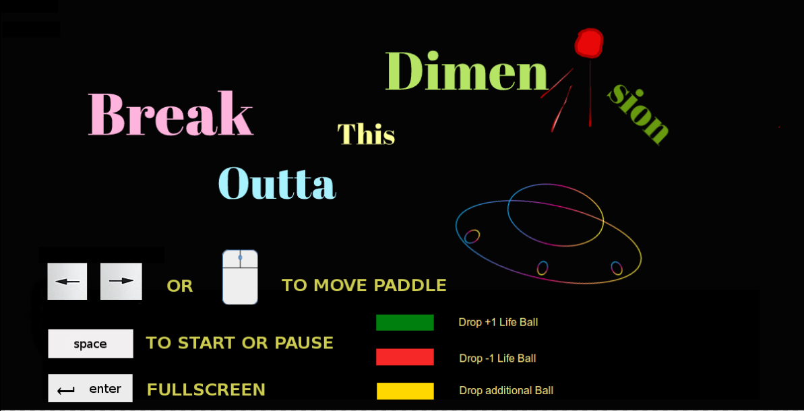

## Break Outta This Dimension!

### Play
[live link]('https://zlindacz.github.io/BreakOuttaThisDimension/')

### Background

"Break Outta This Dimension" is a single-player game written with JavaScript and uses HTML5 Canvas. The player controls a paddle (actually a spaceship) at the bottom of the screen and moves it back and forth with arrow keys or the mouse to keep the ball on the screen. The goal is to destroy the obstacles on the opposite side of the paddle by bouncing the ball on them. The obstacles disappear after getting hit a set amount of times, depending on the nature of the obstacle. Obstacles can also unleash an additional ball, a life-giving ball, or a contact grenade, which must be avoided as contact with the paddle will cause a loss of life. The player starts out with three lives.

### Main features
- [X] Player is first brought to a landing page that has instructions for how to player
- [X] From there, press "m" (menu) to start the game
- [X] Player can pause the game and go back to the landing page by pressing "m" during the game
- [X] The arrow keys control the paddle
- [X] The mouse also controls the paddle
- [X] Press the "Enter" key to go into full screen play ("Esc" to exit full screen mode)
- [X] Red obstacle drops a contact grenade from a random location along the top of the screen
- [X] Yellow obstacle drops a second ball
- [X] Green obstacle drops a ball that gives another life if caught
- [X] Grey obstacles require two hits before disappearing
- [X] The balls speed up the more they are hit, so the longer you play, the faster they go
- [X] Pop ups to alert when player has won or lost

### The Code

#### The Landing Page and Pause




The toggling of the landing page was achieved using two canvases held together in a wrapper div in the body of the entry file:

```
<div class="wrapper">
  <canvas id="canvas" width="1000" height="550" visibility="hidden"></canvas>
  <canvas id="welcome-canvas" width="1000" height="550" visibility="visible"></canvas>
</div>
```
The first canvas contains all the elements of the game, while the second canvas, and last evaluated, is the landing page. The visibility of the landing page is turned on while the game page defaults to invisible until player hits the "m" key and switches the visibilities of the two canvases. The paused variable is initially set to true.

The keyDownHandler listens for the event when certain keys, such as "m", is pressed:
```
function keyDownHandler(e) {
  if (e.keyCode == 39) {
    rightPressed = true;
  } else if (e.keyCode == 37) {
    leftPressed = true;
  } else if (e.keyCode == 77) { // m for menu
    togglePause();
  }
}
```
And when that happens, the togglePause function is triggered:

```
function togglePause() {
  let menu = document.getElementById("welcome-canvas");
  if (paused) {
    menu.style.visibility = "hidden";
    canvas.style.visibility = "visible";
    paused = false;
    draw();
  } else {
    menu.style.visibility = "visible";
    canvas.style.visibility = "hidden";
    paused = true;
  }
}
```

#### Controlling the paddle

The left and right arrow keys were bound to the movements of the paddle similar to how the "m" toggles pause and the landing page, with one key difference: the game needs to listen to both keydown and keyup so that the player can just hold down on an arrow the paddle will continuously move in that direction until it hits the edge of the canvas. The keyUpHandler is very similar to the keyDownHandler as shown above, except that the leftPressed and rightPressed are set to false.

To bind the mouse, we needed another evenListener for "mousemove", an event that fires when the mouse pointer moves over the canvas. MouseEvent's clientX gives us the x-coordinate of the pointer.

```
function mouseMoveHandler(e) {
  var relativeX = e.clientX - canvas.offsetLeft;
  if (relativeX > paddleWidth/2 && relativeX < canvas.width-paddleWidth/2) {
    paddleX = relativeX - paddleWidth/2;
  }
}
```
In this function, relativeX gives the position of the pointer relative to the canvas, as the paddle's x-coordinate is also relative to the canvas, this makes it easier to map the mouse to the paddle. We map the mouse to the center of the paddle, so the if-statement prevents part of the paddle disappearing into the edge of the canvas if the mouse were to get too close to the edge. Having the mouse control the paddle gives a smoother playing-experience, but the player also gets a choice.

#### Different obstacles have different properties

The gray obstacles require two hits to disappear. They have a "status" of 2 as part of their properties, and every time a ball makes contact with it, its status is reduced by 1. Only obstacles with a status of 1 or higher are displayed.

Bricks are made iteratively following predetermined dimensions. A regular brick has a blue color and no other special properties:
```
{ status: 1,
  color: "#3964e6",
  colorSet: false,
  moreBalls: false,
  extraLife: false,
  grenade: false
}
```
The colors and other properties of the special obstacles are set later in a function called randomSpecial. There, 10 bricks are turned into gray and given a status of 2. Obstacles are chosen randomly, so it's possible to have games with no gray, no red, no green, or no yellow, and any combinations of those. If this happens and the player wants to play with all special bricks, they just need to refresh the page and start over.
```
for (i=0; i<10; i++) {
  let rowGrey = randomRow();
  let columnGrey = randomColumn();
  let brickGrey = bricks[columnGrey][rowGrey];
  if (!brickGrey.colorSet) {
    brickGrey.color =  "#c0c0c0";
    brickGrey.status = 2;
    brickGrey.colorSet = true;
  }
};
```

The yellow brick triggers the release of another ball which follows its own trajectory and responds to interactions with the paddle and the walls by changing colors and directions. When the ball collides with a yellow brick with the moreBalls property, as detected by the collisionDetection function, a variable called dropAdditionalBall is switched to true, and the draw function of the game draws an additionalBall and tracks its movements until it is lost.

The logic for the other two types are similar, although the grenade or life-orb do not bounce and merely fall from the top of the canvas, at randomly selected x-coordinates.

#### Ball speeds up after every hit

Every time the ball makes contact with the paddle, the ball changes its direction and increases speed by 5%.

` ball.dy = -ball.dy * 1.05; `

### Future improvements

There are many levels and features that can be added.  Some anticipated updates are:

- [ ] Additional levels that have different patterns of obstacles
- [ ] Sound effects, music, and adjustable volume
- [ ] More variety of "give-backs" (e.g. balls that change paddle size, that give bullets, etc)
- [ ] Obstacles that move
