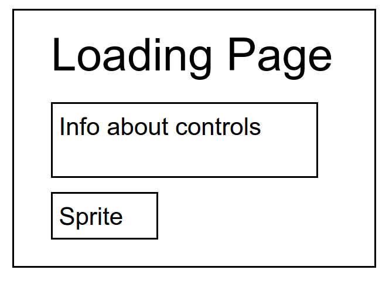
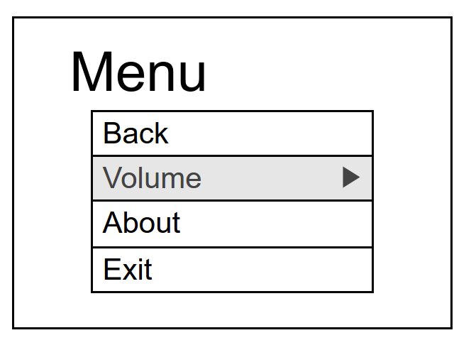
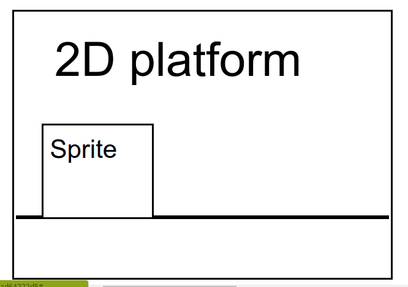
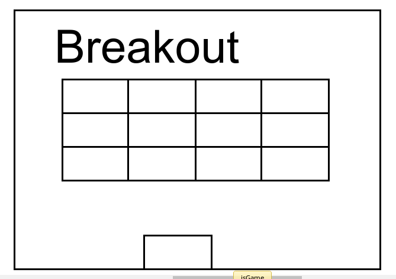
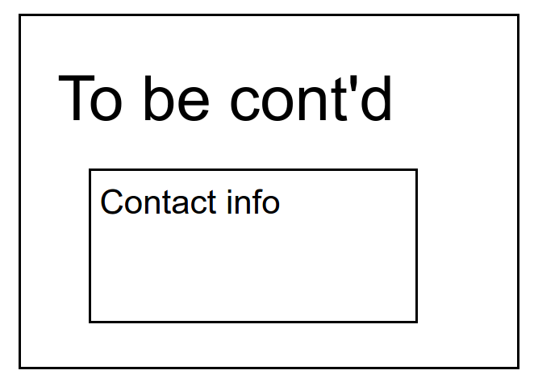

## Break Outta This Dimension!

### Background

"Break Outta This Dimension" is a side-scrolling, role-playing platform game that is also interspersed with single-level arcade games.

The game is character- and story-driven, featuring pre-recorded dialogue and text on the screen between characters. To stay under the time constraint for this project, only the first level of the game Breakout will be featured along with several frames of 2D side-scrolling adventure.

The demo will cover these scenes:
0) The loading page will feature a controllable sprite that's the main character, while instructions are displayed above
1) On your way to school, you encounter some strange-looking creatures. Player must jump over them to proceed, or they lose a life.
2) In the next scene, you see the school in the background with a portal above, aliens descending. You receive a call from Kichi, your friend who is still inside.
3) You enter the school and a phalanx of aliens block your way in. You vanquish them in a Breakout game-like fashion
4) You meet up with Kichi in a classroom, when a large alien approaches. You escape out of a window. To be continued...

### Functionality & MVP  

In this game, the user will be able to:

- [ ] Start and pause the game
- [ ] Adjust / mute the volume
- [ ] Control the main character or Breakout paddle with arrow keys
- [ ] Have three lives before losing

In addition, this project will include:

- [ ] A loading page that shows instructions and allows the player to try out the controls
- [ ] A production Readme

### Wireframes

This app will consist of a single screen. The escape key will take the user to a modal menu. From there the player can exit to the loading screen or resume the game. The modal will also have links to my Github and LinkedIn sites.

On the Loading page below, the how-to-play of the game will be displayed in a few simple lines, while player can interact with the sprite underneath to practice moving and jumping

The modal menu pops up and pauses the game whenever the player hits the escape keys

There will be three scenes utilizing 2D platform game-like play, feature a few alien enemies that the player must jump over because she is currently over-powered

A single level of a Breakout like game

Once the game concludes, the player will be brought to a closing screen where info about the creator of the game will be displayed, as well as a "To be continued" message

### Architecture and Technologies

This project will be implemented with the following technologies:

- Vanilla JavaScript and `jquery` for overall structure and game logic,
- `Easel.js` with `HTML5 Canvas` for DOM manipulation and rendering,
- Webpack to bundle and serve up the various scripts., such as Breakout, , and so on

In addition to the webpack entry file, there will be several scripts involved in this project:

- `play.js`: this script will handle the logic for creating and updating the necessary `Easel.js` elements and rendering them to the DOM.
- `main.js`: this script will draw and describe the movements of the main character and Kichi
- `aliens.js`: this script will describe the movement and behavior of the alien creatures
- `breakout.js`: this script will contain the logic and rules for the breakout game
- `loading.js`: this script will contain the elements for the loading page
- `menu.js`: this script will be incorporated into all the frames so that the menu can be accessed from anywhere
- `continued.js`: this is the final script that will have the elements and links for the closing view
- `style.css`: this will be broken down into further sheets to house all the css styling for the game

### Implementation TimelineHave a functional grid on the `Canvas` frontend that correctly handles iterations from one generation of the game to the next

**Day 1**: Setup all necessary Node modules, including getting webpack up and running and `Easel.js` installed.  Create `webpack.config.js` as well as `package.json`.  Write a basic entry file and the bare bones of `play.js`, `loading.js`, `continued.js`, and `menu.js` scripts outlined above.  Learn the basics of `Easel.js`.  Goals for the day:

- Get a green bundle with `webpack`
- Learn enough `Easel.js` to render an object to the `Canvas` element
- Finish making barebones `breakout.js`

**Day 2**: Dedicate this day to learning the `Easel.js` API.  First, build out the main and alien characters to connect to the `Game` object in `play.js`.  Then, use `play.js` to create and render loading page and the breakout game. Build in the ability to toggle the sound.  Goals for the day:

- Complete the `main.js` and `alien.js` modules (constructor, update functions)
- find and/or create artwork for the backgrounds/sprites
- record dialogue for the characters, finish the game script

**Day 3**: Flesh out the user-interactions, keyCode listening events. Player has 3 lives, level calculation for interactions with aliens. Goals for the day:

- Player and alien interactions
- Saving player lives information and decrementing it accordingly

**Day 4**: Style the frontend, making it polished and professional.  Goals for the day:

- Styling styling styling

### Bonus features

There are many levels and features that can be added.  Some anticipated updates are:

- [ ] From the modal menu, player can choose level of difficulty (which determines number of aliens, size of Breakout paddle, etc)
- [ ] Player levels up after completing a level
- [ ] The adventure continues! The friends get separated when you are swallowed up by a portal and transported to the alien world. Switch between characters and play in different worlds to reunite them and defeat the aliens. The game will also feature weapons for combat.
- [ ] Additional arcade levels such as Falling Ball, Frogger, vehicle steering games, and more.
