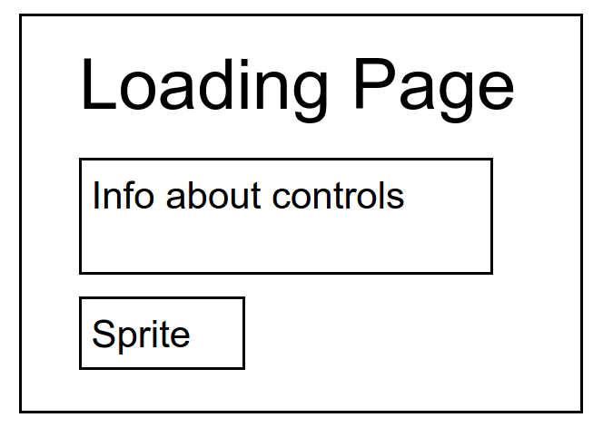
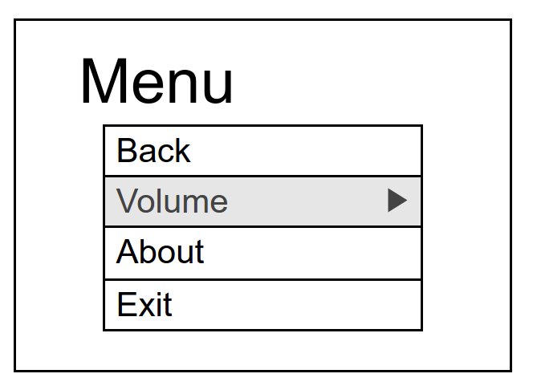
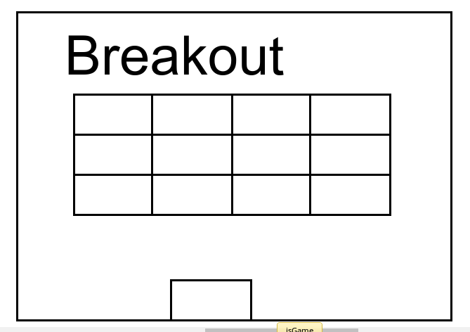

## Break Outta This Dimension!

### Background

"Break Outta This Dimension" is a Breakout!-like game that is a scene out of a story-line driven 2-D platform game. The player controls a paddle (actually a spaceship) at the bottom of the screen and moves it back and forth to keep the ball (grenade) on the screen. The goal is to destroy the obstacles (invading aliens) on the opposite side of the paddle by bouncing the ball on them. The obstacles disappear after getting hit a set amount of times, depending on the nature of the obstacle. Obstacles can also unleash more grenades or contact grenades, which must be avoided as contact with the paddle will cause a loss of life. The player starts out with three lives.

The game will have the following elements:
0) landing page with instructions and a start button
1) enter key toggles full screen
2) esc pauses the game and brings up the menu
3) obstacles can rain down more balls, give life-giving orb, throw contact grenade, make paddle bigger/smaller, or require two hits
4) toggle sound/music

### Functionality & MVP  

In this game, the user will be able to:

- [ ] Start and pause the game
- [ ] Adjust / mute the volume
- [ ] Control the Breakout paddle with arrow keys or mouse
- [ ] Have three lives before losing
- [ ] Obstacles may "give back"

In addition, this project will include:

- [ ] A loading page that shows instructions and allows the player to try out the controls
- [ ] A production Readme

### Wireframes

This app will consist of a single screen. The escape key will take the user to a modal menu. From there the player can exit to the loading screen or resume the game. The modal will also have links to my Github and LinkedIn sites.

On the Loading page below, the how-to-play of the game will be displayed in a few simple lines, while an animation plays

The modal menu pops up and pauses the game whenever the player hits the escape keys

A single level of a Breakout like game

### Architecture and Technologies

This project will be implemented with the following technologies:

- Vanilla JavaScript and `jquery` for overall structure and game logic
- `Easel.js` with `HTML5 Canvas` for DOM manipulation and rendering

- `play.js`: this script will handle the logic for creating and updating the necessary `Easel.js` elements and rendering them to the DOM.
- `breakout.js`: this script will contain the logic and rules for the breakout game
- `loading.js`: this script will contain the elements for the loading page
- `menu.js`: this script will be incorporated into all the frames so that the menu can be accessed from anywhere
- `application.css`, `game.css`, `menu.css`, `landing.css`: this will contain the css styling for various aspects of the game

### Implementation Timeline

**Day 1**: Display the ball, bricks, and paddle

**Day 2**: Make paddle respond to key presses, add lives

**Day 3**: Add full screen API, give random bricks different properties, turn bricks into sprites

**Day 4**: Create landing page, "m" toggles menu, add sound

### Bonus features

There are many levels and features that can be added.  Some anticipated updates are:

- [ ] From the modal menu, player can choose level of difficulty (which determines speed of balls, distance to aliens, etc)
- [ ] Additional levels that have different combinations of aliens
- [ ] More variety of brick "give-backs" (e.g. that change paddle size)
- [ ] Bricks that move
